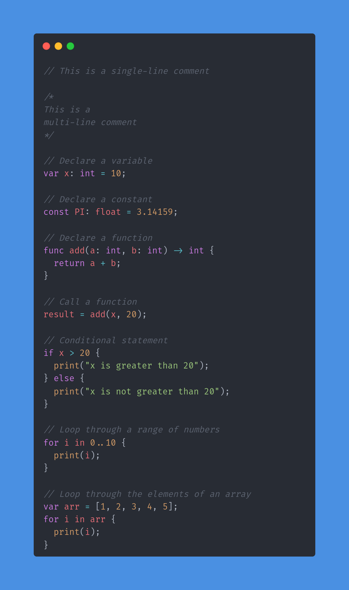

# Iris

Iris is hopefully going to be a very simple scripting language created for the
purpose of doing small things, like filesystem automation, and other **_small_**
things.

### This is an example of what I hope Iris syntax will look like -



## Task commands

- `task compile`
    - This command will compile iris into a ./build/ directory
- `task clean`
    - Clean will clean up the iris source file directory, removing build, .vscode, and deno.lock    
- `task run`
    - Run will compile iris and run a file of your choice

***How to run a file with iris run?***
```bash
task run -- ./path/to/file.iris
```

As stated above, this will compile iris and run an iris file.

***How to run an iris file without task?***
```bash
deno run -A ./src/main.ts run ./path/to/file.iris
```

***How to compie iris?***
```bash
deno compile -A -o ./build/iris ./src/main.ts
```